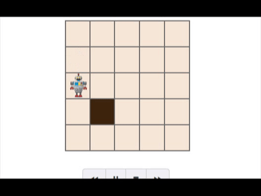

# Bot for cleaning the randomly generating dirty cells
The bot is given 200 moves to clean as many dirty cells as possible. The grid initially has 1 dirty cell. When the bot cleans this cell, a new cell in the grid is made dirty. The new cell can be anywhere in the grid. 
It's the solution for the HackeRank's Artificial Intelligene problem named 'BotClean Stochastic'.

### Results

