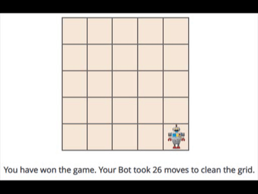

# Bot for cleaning
Meet the bot. It's a cleaning bot whose sensor is a head mounted camera and whose actuators are the wheels beneath it. It's used to clean the floor. It's the solution for the HackerRank's artificial Intelligence problem named 'BotClean'

### Results

