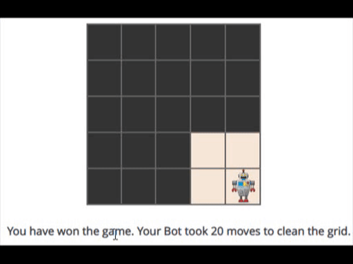

# Bot for cleaning with partially visible environment
The game Bot-Clean took place in a fully observable environment, i.e., the state of every cell was visible to the bot at all times.
Let us consider a variation of it where the environment is partially observable. The bot has the same actuators and sensors. 
But the sensors visibility is confined to its 8 adjacent cells.
It's the solution of HackerRank's Artificial Intelligence problem named 'Bot Clean Partially Observable'

### Results

